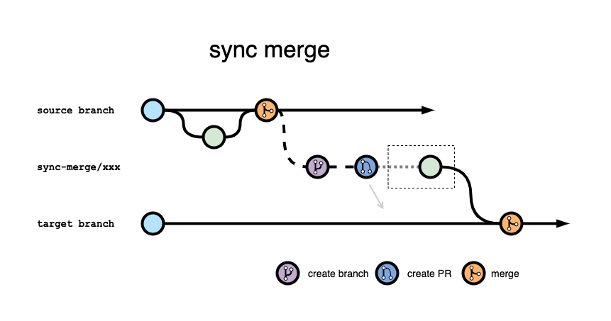
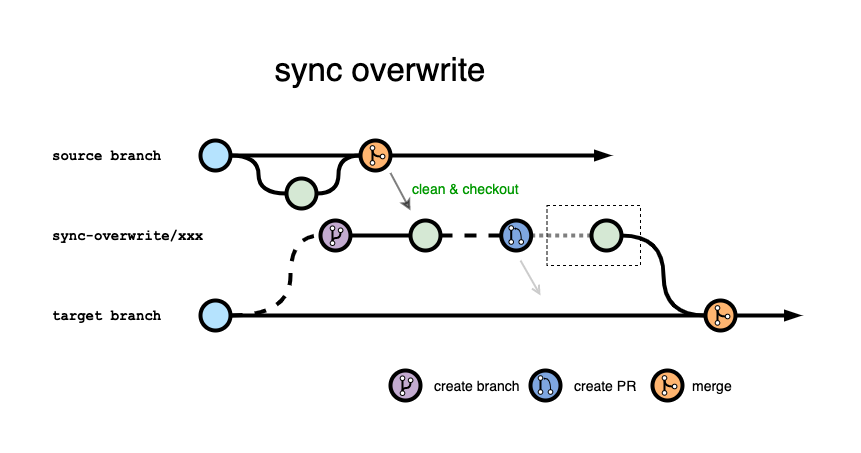
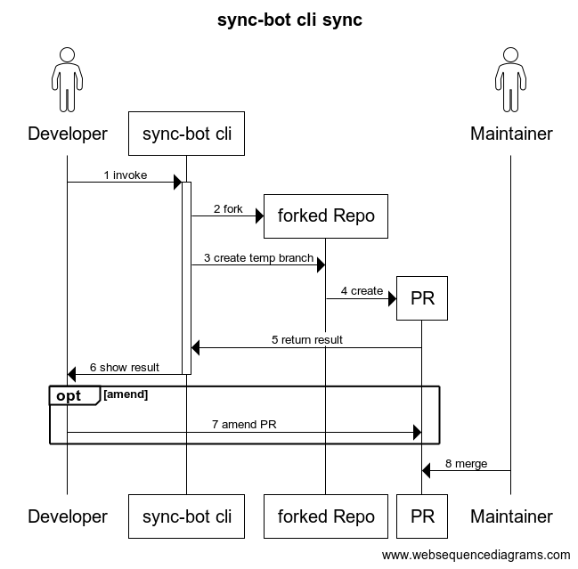
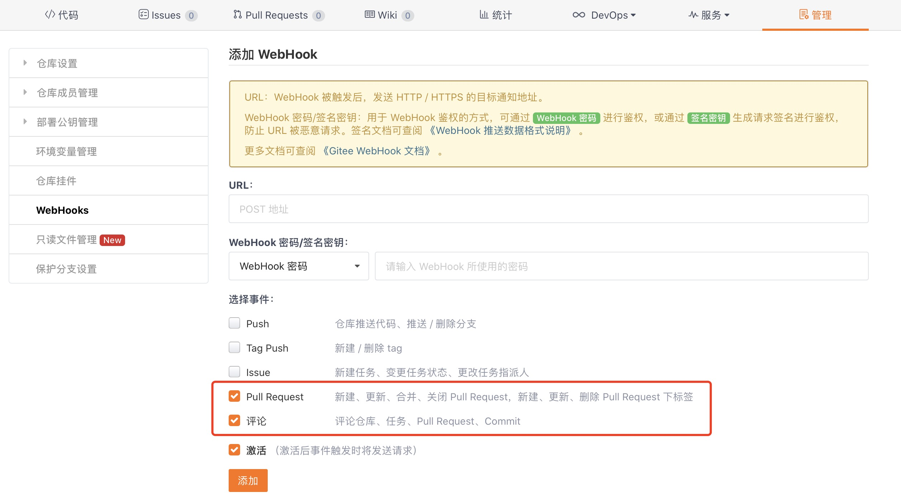
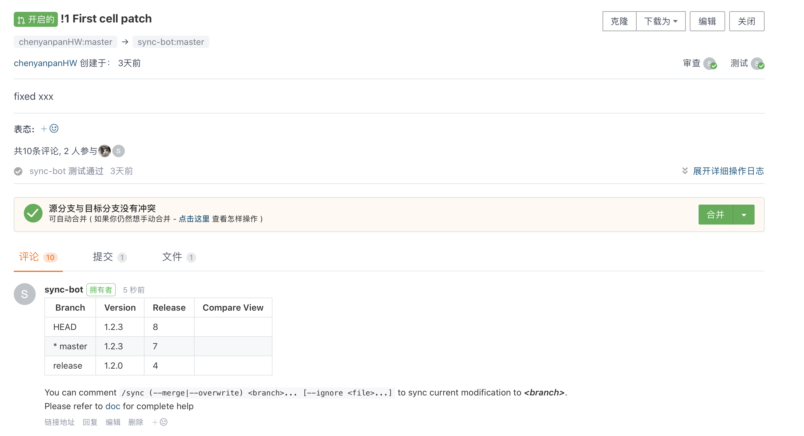
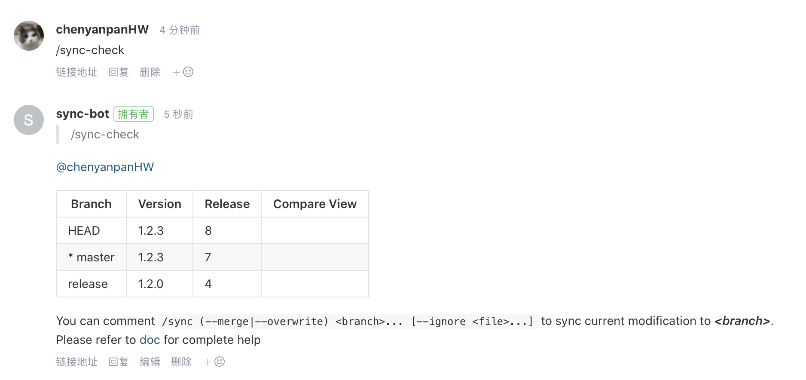
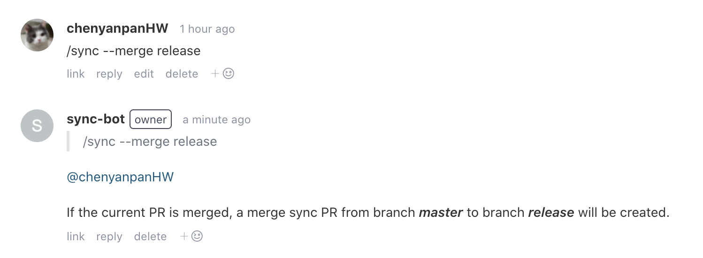

# sync-bot

#### 介绍
A tool for handling synchronization between branches

# 背景

openEuler 包含几千个开源软件，目前已发布多个发行版本。每个开源软件在 __软件包仓__ ([src-openEuler](https://gitee.com/src-openeuler)) 有一个对应 Git 仓库，存放用于构建开源软件 rpm 包的相关文件。

每个仓库有对应 openEuler 发行版本的分支，如 openEuler1.0、openEuler-20.03-LTS、openEuler-20.09 等，还有对应 SP 版本的分支，如 openEuler-20.03-LTS-SP1，以及开发相关的分支，如 master 和 openEuler-20.03-LTS-Next 等。这些分支长期存在，并且一般设置为保护分支，不允许在分支上直接提交 commit 进行修改。

当前软件包仓存在一些同步问题：

1. 在某个分支上修改合入之后，遗漏将修改应用到其它分支，导致问题未在多个发行版本的分支上同步修改

    这类问题很多。

2. 同一修改在不同分支上手动提交 commit

    有些开发人员在多个分支上进行手动修改，这样操作不仅繁琐、耗时，还可能因为手动操作的人为错误，导致同一修改在不同分支上的提交不一致，给后续分支之间文件比对、问题回溯造成不必要的麻烦。以 [lsof](https://gitee.com/src-openeuler/lsof) 为例，openEuler-20.03-LTS 分支和 openEuler-20.03-LTS-Next 分支之间，changelog 行尾多出一个空格。


随着 openEuler 引入越来越多开源软件，持续发布新的版本，将会有更多软件修改及分支同步的工作，如果仅依靠人工手动操作，必将导致大量的重复性工作，也会导致大量遗漏同步的问题。

#### 关于分支的说明
> 在本文档中，版本分支，长期分支，保护分支含义相同，指的是 src-openEuler 仓库中 openEuler1.0、openEuler-20.03-LTS、openEuler-20.09、master 等分支，这些分支设置保护分支，不能直接 push 或者 commit，只能通过 PR 方式合入修改。
临时分支指的是贡献者将 src-openEuler 仓库 fork 到自己名下，自己名下仓库中的分支，贡献者在这些分支上提交 commit 修改，然后向保护分支提其 PR；或者是工具在 src-openEuler 仓库临时创建的分支，这些分支修改后向版本分支提交 PR，通常在 PR 合入时自动删除。


# 调研

1. 搜索相关方案

    目前搜索不到其它发行版 OS 实现分支同步的工具。

2. 研究 Fedora 仓库修改情况

    查看 gzip 和 coreutils 等多个仓库的提交记录，各个分支之间的修改时间以及修改内容，推断 Fedora 的仓库是由人工操作方式修改。

# 同步的定义

__同步__ 指的是 Git 仓库分支之间的操作；但本文档涉及的同步，不是指 Git 本地仓库与远程仓库分支之间 fetch/pull/push 之类的操作；也不是指源分支 A 同步到目标分支 B 之后，分支 B 的内容一定与分支 A 一致。这里的同步指的是 __修改的同步__，将源分支 A 上的修改同步到目标分支 B，是在保证目标分支 B 正确的前提下，把在 A 上的修改应用在 B 上。有些情况，确实需要用源分支的文件，覆盖目标分支，使得两者的文件内容一致。

__根据 openEuler 社区代码管理规则，版本分支需要以 PR 的方式修改，因此同步操作的最终结果也是以向目标版本分支提交 PR 的方式呈现。__


# 解决2种场景的同步问题

__1. 软件仓现状的同步问题__

当前软件仓一些仓库已经存在未同步问题，需要识别这些问题，在需要的时候执行同步操作。这种情况关注的是软件某个版本分支最新内容(tip of branch)到另一个版本分支的同步问题。

__2. 持续开发过程中的同步问题__

开发过程中，修改是以 PR 的形式提交到某一个版本分支，一旦 PR 被合入，就产生是否需要将修改同步到其它多个版本分支的问题。为及时处理这种场景下的同步，在 PR 创建之后、被合入之前，就需要让同步相关操作参与进来，在 PR 合入前考虑同步问题，这样可以尽量避免 PR 合入之后遗漏同步。


# 方案设计

## sync-bot 架构

为解决上述2种场景的同步问题，同步工具包含两个部分：命令行工具 __sync-bot cli__ 和服务 __sync-bot service__，两者之间独立运行。


__1. sync-bot cli__

用于解决第1种场景的同步问题，用户在本地执行，可以检查软件某个源分支到某个目标分支之间的差异，执行同步操作等。用户可以是仓库的 maintainer，也可以是开发者。
maintainer 可以在 src-openEuler 上创建临时分支，因此 maintainer 可以将同步涉及的修改提交到 src-openEuler 临时分支，向版本分支提交 PR，考虑允许 maintainer 在 src-openEuler 仓库创建临时分支，主要是为了避免耗时的 fork 操作，在多个仓库的情况下可以节省大量的时间。
开发者无法直接创建临时分支，因此需要先将 src-openEuler 仓库 fork 到自己名下，在自己名下仓库的分支进行修改，再向 src-openEuler 仓库的目标版本分支发起 PR。


__2. sync-bot service__

为解决第2种场景同步问题，需要实现一个服务 sync-bot service ，sync-bot service 通过 Gitee WebHook 监听 src-openEuler 仓库 PR 相关动作，在 PR 创建之后提示 maintainer 关注同步问题，根据 maintainer 在 PR comment 中的命令，在 PR 被合入之后，向指定的目标版本分支执行同步操作。
这里考虑 PR 被合入之后再执行同步操作，原因是 PR 创建之后可能会修改、关闭，如果当前 PR 未合入就执行同步操作创建新的 PR，那么这些新 PR 需要随着当前 PR 修改或关闭，这种关联的操作非常复杂；另外，在 PR 被合入之后再执行同步操作，可以与 cli 同步保持一致，都是从版本分支到另一个版本分支同步，而不是从 PR 的临时分支向版本分支同步。


## 同步策略

__1. merge__

__合并同步__ 是最简单的同步方式，从某个源版本分支向目标版本分支提交 PR 进行同步。
首先要从源版本分支创建临时分支 sync-merge/xxx，然后从临时分支向目标版本分支提交 PR。先创建临时分支的原因是 PR 可能需要进一步修改才能合入到目标版本分支，但是这些修改不是源版本分支需要的，不能包含到源版本分支中，因此需要在 PR 临时分支进行修改。
如果是 maintainer，可以直接修改临时分支；如果是开发者进行修改，可以将临时分支 sync-merge/xxx 更新到自己名下仓库，在自己名下仓库修改后向 src-openEuler 仓库的 sync-merge/xxx 发起 PR，由 maintainer 先合入修改临时分支的 PR，然后 maintainer 再合入同步的 PR。
需要注意，不允许改写 sync-merge/xxx 中的 commit 历史，否则，再次从源版本分支向目标版本分支执行同步，会执行重复的同步修改。




__2. overwrite__

__覆盖同步__ 是将源版本分支的文件覆盖目标版本分支，使得目标版本分支中的内容与源版本分支保持一致。
首先从目标版本分支创建临时分支 sync-overwrite/xxx，清空 sync-overwrite/xxx 分支中的文件，从源版本分支 checkout 文件，然后从 sync-overwrite/xxx 向目标版本分支提交 PR。
同样 maintainer 和开发者可以对临时分支 sync-overwrite/xxx 进一步修改，更新 PR 内容。
不同版本分支中可能保存一些该分支特有的文件，这些文件不应该受到同步操作的影响，在覆盖同步的时候需要忽略这些文件。




__3. pick__

__挑选同步__ 类似 git-cherry-pick 操作，目标指将源版本分支中的 commit 应用到目标版本分支。
sync-bot cli 能够从源版本分支挑选某个 commit 或者某段 commit 区间，应用到目标版本分支上；sync-bot service 关注的是当前的 PR，所以是将当前 PR 包含的 commit 同步到目标分支，具体方式是识别当前 PR (可能包含多个 commit）包含的文件增加、删除、修改操作，将涉及的文件的最终状态（最后一个 commit）同步到目标版本分支。


## sync-bot cli -- 未实现

命令行工具为二进制可执行程序，命名为 `sync-bot-cli` ，优先考虑在 Linux 环境上运行。命令行工具包含以下子命令：

__1. check__

检查 \<repo> 仓库源版本分支 \<source> 与其它目标版本分支 \<target> 软件版本

```
sync-bot-cli check --repo <repo> --source <source> --target <target>...
```

输出结果:
| Branch | Version | Release | 
| --- | --- | --- |
| * master | 1.2.3 | 10 |
| dev | 1.2.5 | 11 | 
| release | 1.2.3 | 10 |

> *前缀表示源版本分支


__2. log__

检查 \<repo> 仓库 \<source> 分支先于 \<target> 分支的 commit 列表，类似 `git log <target>..<source>`

```
sync-bot-cli log --repo <repo> --source <source> --target <target>
```

输出结果：
| Sha | Datetime | Message |
| -- | -- | -- |
| 31c79ad | 2020-08-27 10:17:06 | !14 fix patch error Merge pull request !14 from xxx/master |
| 4f14510 | 2020-08-26 16:47:44 | fix patch error |


__3. diff__

对比 \<repo> 仓库 \<source> 分支和 \<target> 分支文件差异，类似 `git diff <source> <target>`

```
sync-bot-cli diff --repo <repo> --source <source> --target <target>
```

输出结果：
```
diff --git a/coreutils.spec b/coreutils.spec
index 74f35e5..f5a08aa 100644
--- a/coreutils.spec
+++ b/coreutils.spec
@@ -1,6 +1,6 @@
 Name:       coreutils
 Version:    8.32
-Release:    1
+Release:    2
 License:    GPLv3+
 Summary:    A set of basic GNU tools commonly used in shell scripts
 Url:        https://www.gnu.org/software/coreutils/
@@ -135,6 +135,9 @@ fi
 %{_mandir}/man*/*
...
```


__4. sync__

\<repo> 仓库从 \<source> 分支向 \<target> 分支执行同步操作

```
sync-bot-cli sync (--merge|--overwrite) --repo <repo> --source <source> --target <target> [--ignore <file>...] [--fork <fork>]
```
> --merge|--overwrite：对应上述的合并同步策略和覆盖同步策略
> --ignore <file>...：在覆盖同步策略中忽略的文件
> --fork <fork>...：开发者没有权限在 src-openEuler 上直接创建临时分支，需要先将 \<repo> 仓库 fork 到自己名下




<!--
__5. inspect__ (优先级低)

inspect 用于审视 PR comment 同步命令，是否创建对应 PR
```
sync-bot inspect --repo <repo>
```

输出结果:
| Comment | PR | Status | 
| --- | --- | --- |
| https://gitee.com/sync-bot/sync-merge-example-bak/pulls/1#note_3567918 | !2 [sync-merge] sync modification of master <br>!3 [sync-merge] sync modification of master | merged<br>closed |
| https://gitee.com/sync-bot/sync-merge-example-bak/pulls/1#note_3581569 | \<miss> | | 

-->


## sync-bot service

src-openEuler 仓库 WebHooks 配置需要勾选 “Pull Request” 及 “评论” 事件。
sync-bot service 启动 Web 服务监听，Gitee WebHook 在对应事件发生时向 sync-bot service 发送请求。




#### sync-bot service 支持的 PR comment 命令

用户可以在 PR 通过 comment 命令指示 sync-bot service 执行动作，PR comment 支持以下命令：

__1. /sync-check__

检查命令用于检查当前 PR 以及相关版本分支的状态，列出当前 PR 临时分支、PR 的目标分支、以及仓库其它版本分支中软件的版本信息。

命令格式
```
/sync-check
```

sync-bot service 回复内容如下：

This repository has the following protected branches:

| Protected Branch | Version | Release |
|---|---|---|
|[branch1](https://gitee.com/open-euler/syncbot-example/tree/branch1)|
|[branch2](https://gitee.com/open-euler/syncbot-example/tree/branch2)|

Use `/sync <branch>` command to register the branch that the current PR changes will synchronize to.
Once the current PR is merged, the synchronization operation will be performed.
(Only the last comment which include valid /sync command will be processed.)


__2. /sync__

同步命令用于指示 sync-bot service 向哪个分支执行哪种同步操作。用户在 PR 评论区输入命令，sync-bot service 并不会立刻创建同步操作对应的 PR，而是等待当前 PR 被合并后再执行同步动作。

sync 命令与命令行工具的 sync 子命令功能类似，命令格式
```
/sync (--merge|--overwrite) <branch>... [--ignore <file>...]
```
> 允许同一个命令指定多个同步分支

当用户在评论区输入 `/sync` 命令，sync-bot service 需要对用户评论进行响应，回复如下
```
When the current PR is merged, a sync-merge PR from branch master to branch release will be created.
```

<!--
__3. /sync-disable__

取消同步命令，指示当前提交的 PR，不需要同步到其它分支。
-->

#### sync-bot service 监听 PR 事件及处理流程


__1. 创建 PR__

只监听贡献者创建的 PR，忽略 sync-bot 自己创建的同步 PR（标题以 [sync] 开头)。
一旦有 PR 创建，sync-bot 会对 PR 进行评论，回复内容与 `/sync-check` 的响应回复一致。



__2. 检查命令__

当用户在 PR 评论区评论 `/sync-check` 命令时，sync-bot service 检查当前的各个分支的最新状态并回复。




__3. 同步命令__

当用户在 PR 评论区评论 `/sync` 命令，sync-bot service 需要区分当前 PR 是否已经被合入：

a) 如果当前 PR 未被合入，用户评论 `/sync` 命令仅仅做了登记，sync-bot service 对用户的命令进行回复，实际同步操作等待 PR 被合入时再执行。



b) 如果当前 PR 已经是被合入状态，sync-bot service 会立即执行同步操作，创建对应的 PR。


c) 如果评论的格式不正确，需要及时提醒


__4. PR 被合入__

当贡献者创建的 PR 被合入时，遍历 PR 的 comment，解析 comment 内容，如果存在 `/sync` 命令则执行对应的同步操作创建同步 PR。


__5. PR 被关闭__

sync-bot service 需要监听 sync-bot 创建的 PR 被关闭事件。sync-bot 在提交 PR 时会创建临时分支，如果 PR 的临时分支是在 src-openEuler 仓库中创建，PR 被关闭时，删除对应临时分支，避免仓库中残留临时分支，如果当前 PR 关联 issue，同时也关闭关联的 issue。


## 实现

* 源代码独立仓库存放，独立部署

* 申请一个独立 Gitee 账号

    由 sync-bot service 使用

    类似 ci-bot，具备 src-openEuler 软件仓创建临时分支的权限

* 使用 Golang 开发

    借鉴 ci-bot 架构，有些功能可能可以共用代码

    Golang 实现的程序可以编译成二进制文件，不需要其它安装依赖，方便直接在 Linux 上使用


## 其它

* sync-bot 创建的每个 PR，对应创建一个 issue，避免 PR 遗漏关注。

* Gitee WebHook 请求会校验 https 证书，开发测试过程自签名证书无法使用通过校验，可以在开发测试过程中使用 http，正式上线会部署在 https://api.openeuler.org/

* 在 sync-bot 操作的地方附上使用说明及 sync-bot 仓库 issue 地址，方便用户了解使用以及反馈问题

* 评论、commit message 等使用文本模板方式，避免将文本固化在代码中


## 参考资料

* [OpenEuler Community Command Help](https://gitee.com/openeuler/community/blob/master/en/sig-infrastructure/command.md)


